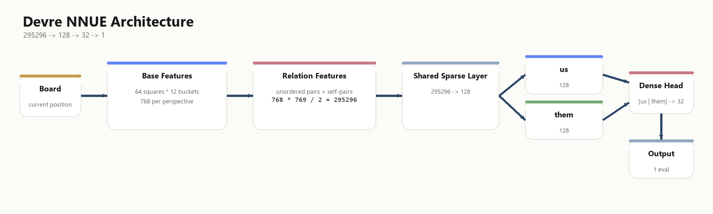

## Devre

Devre is a strong open-source UCI-compatible chess engine written in C++. While writing the engine, I got great help from chessprogramming wiki, talkchess forum, Stockfish discord, and some open-source engines: Ethereal, Vice, and Koivisto. 


## Movegen

* Fancy magic bitboards
* legal movegen with make/unmake.


## Search
* Alpha beta search (PVS)
* Quiessence search
* Transposition table
* Iterative Depening
* Aspiration Window
* Null Move Pruning
* Mate Distance Pruning
* Late Move Reduction
* Check Extension
* Futility prunings
* SEE pruning
* Singular Extension
* Correction History

## Move ordering
*  Hash move
*  Good Captures sorted by Capture History
*  Killer moves
*  countermove
*  History heuristic
*  Bad Captures sorted  by Capture History


## Evaluation

Devre uses a relation-based NNUE for evaluation.
The default net is a sparse `295296 -> 128 -> 32 -> 1` network.



The training data is based on Leela data. The current training pipeline is Python-based. Training resources and other useful NNUE information can be found in the Stockfish Discord.
Thanks to the Stockfish and Leela teams for publishing their training data publicly. 

## Compiling 
 To compile in Linux/Windows with a CPU that supports AVX512/AVX2/SSSE3:
 * to compile with makefile you can use one of the options: ```make``` ```make build=avx512``` ```make build=avx2``` ```make build=ssse3```
